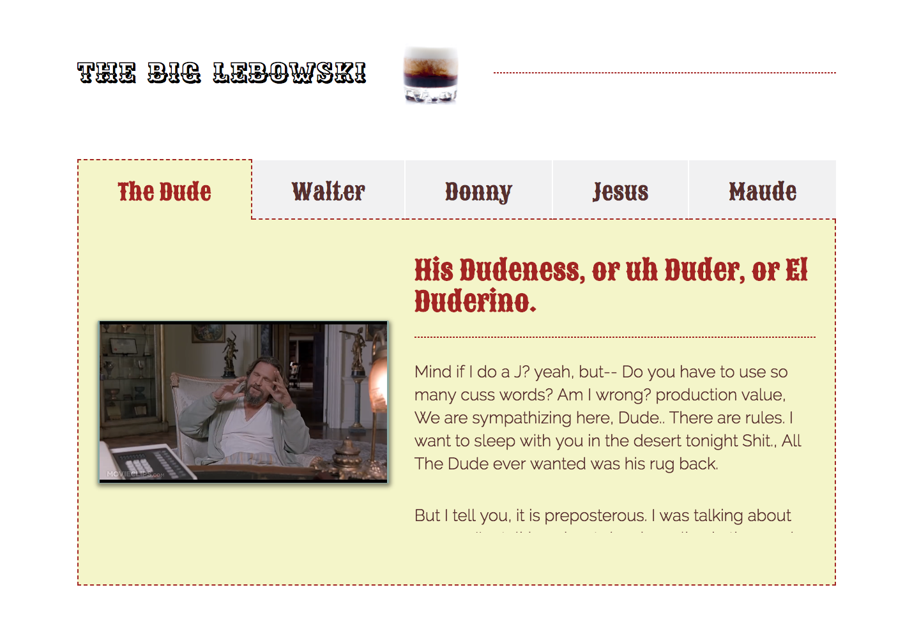
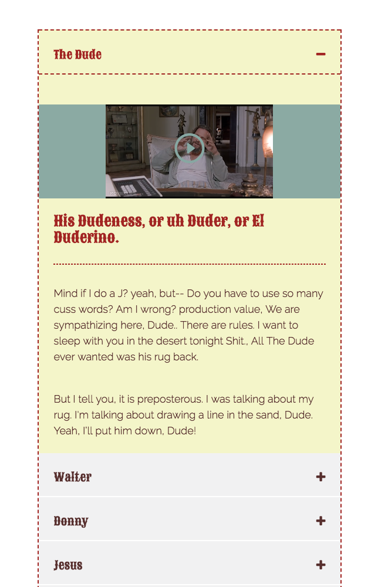

# The Lebowski Challenge - Placewise Digital


### Overview
This was a coding challenge for Placewise Digital in Denver, CO. The task was to complete one of the 3 challenges: a rating widget, an image page, or a 5-tab structure with mobile view. I completed 2 of the 3 and used video instead of images.

[Live Link](https://davidbecker6081.github.io/Placewise-challenge/)
##### Main View


##### Mobile View


--

## Setup

##### Clone repo
  - ```git clone https://github.com/davidbecker6081/Placewise-challenge.git```

##### Open in browser
  - Open ```index.html```


## Project Features

##### Video Play and Pause on Mouse Events
  - When user's mouse enters video, preview will play
  - When user's mouse leaves video, preview will pause and reset

##### Video Player
  - When user clicks on video, video will enlarge into a tv-frame player
  - User can pause video by clicking on the enlarged video, and then play again with a click
  - To close out, user can click on red bowling pins

##### Elastic Tabs
  - If user changes screen size, tabs should retain current position

##### Video Quality and Size
  - Video should load higher quality video on user event clicking the preview (lower quality) video

--

## Next Steps

- Issues have been made for each '**Next Step**' including:
   - Music playing in background for each tab
   - Add video for intro (opening credits)
   - Elastic animation for enlarging video
   - Add bowling icons instead of plus/minus
   - Each character has own color for ```.active```
   - Add inspiration / code section to README
   - Fix audio when max video opens, so that tv on sound is edited in movie edit
   - Fix: `Uncaught (in promise) DOMException: The play() request was interrupted by a call to pause(). `https://goo.gl/LdLk22` - caused by play() returning a promise - need to wait until promise is resolved and then call pause() with a catch error - also need some loading animation - https://developers.google.com/web/updates/2017/06/play-request-was-interrupted`

